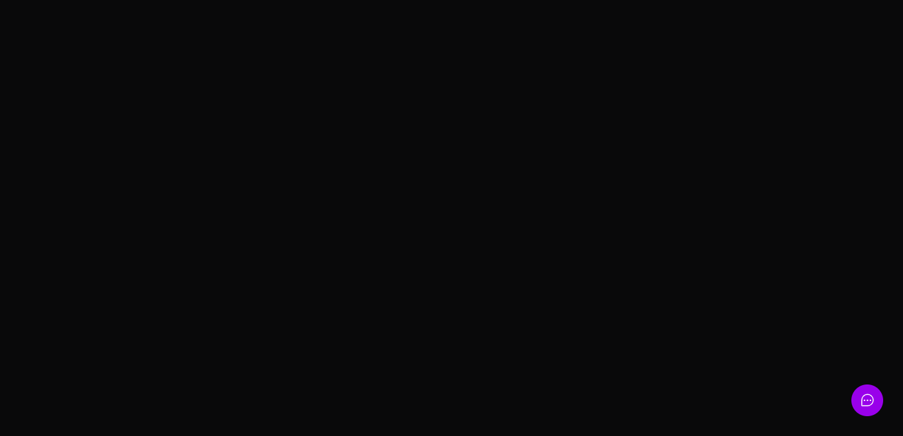
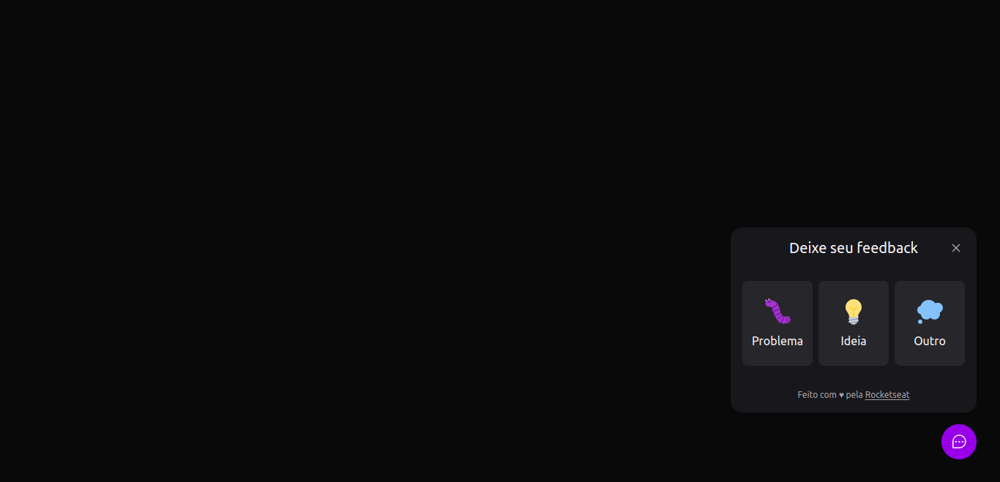
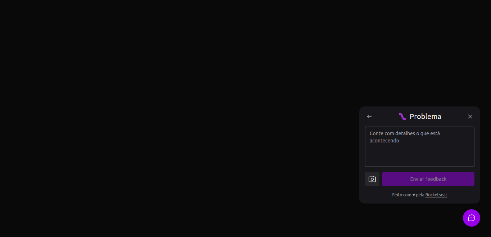
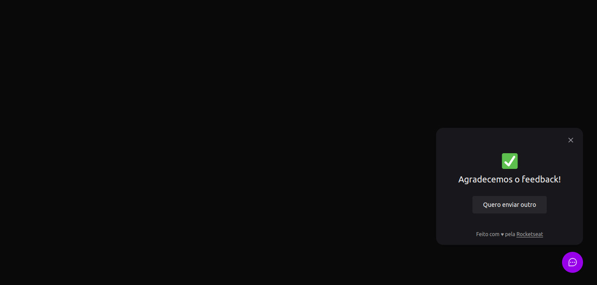
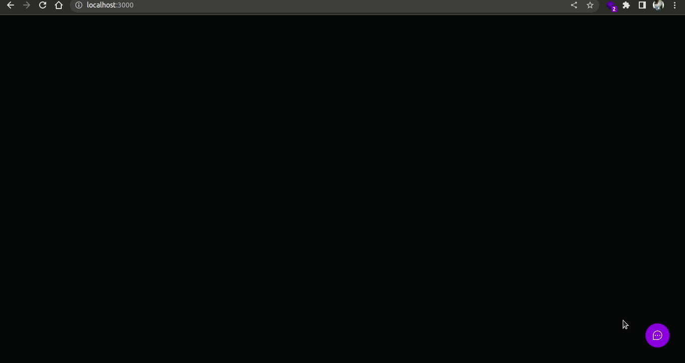
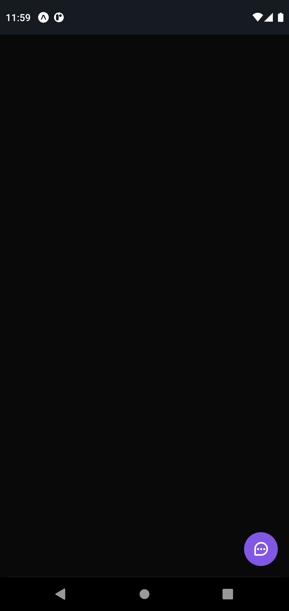
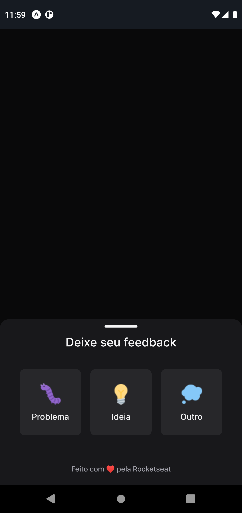
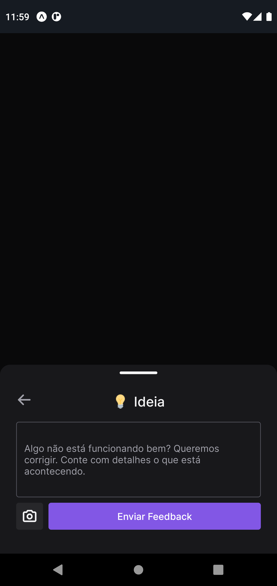
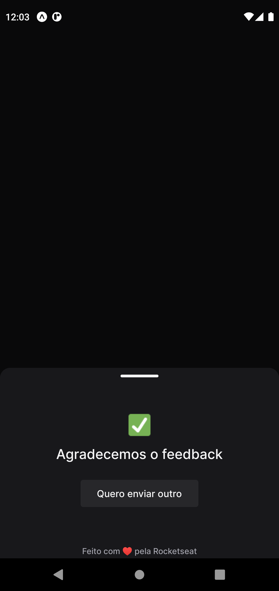
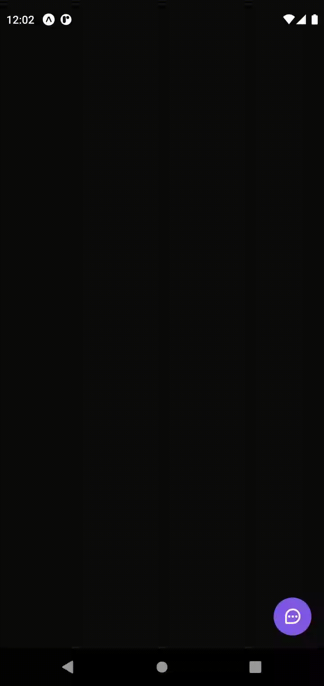

<p align="center">
  
  
  
  
</p>
<br />

<p align="center">
  <a href="#sobre">Sobre</a> •
  <a href="#feedbackwidget">Feedback Widget</a> •
  <a href="#instalação">Instalação</a> •
  <a href="#tecnologias">Tecnologias</a> •
  <a href="#autor">Autor</a>  
</p>

<br />

## Sobre

Projeto desenvolvido durante a <strong>NLW Return</strong>, evento criado pela <strong><a href="https://rocketseat.com.br/">Rocketseat</a></strong>.  
 Um evento 100% online e GRATUITO, com conteúdo exclusivo e INÉDITO.

Ocorreu do dia 02 ao dia 08 de Maio de 2022 e teve como intuito mostrar na prática o poder da stack
<strong><a href="https://nodejs.org/pt-br/">NodeJS</a></strong> +
<strong><a href="https://pt-br.reactjs.org/">ReactJS</a></strong> +
<strong><a href="https://reactnative.dev">React Native</a></strong> e como essas tecnologias podem te levar até os seus maiores objetivos como programador.

## FeedbackWidget

O Feedback widget é uma aplicação disponibilizada para os usuários terem contato com o time de desenvolvimento para que possam falar sobre problemas, repassar alguma ideia que tenham ou falar sobre outros assuntos. A aplicação está disponível tanto na web quanto no mobile e possui as mesmas funcionalidades em ambas as plataformas.

Vamos ver abaixo na pratica como tudo funciona...😎

### Widget na web

Ao acessar a página que contenha o widget teremos no canto inferior direito nossa funcionalidade, conforme imagem a seguir:



Ao clicar no widget, as opções disponíveis serão exibidas para o usuário:



Ao escolher a opção desejada, o usuário terá um pequeno formulário contendo um campo de texto para ele digitar sua mensagem para os desenvolvedores e um botão para tirar um printScreen para anexar na mensagem dele, conforme exemplificado abaixo:



Feito isso, basta enviar o feedback e, após a tela de confirmação abaixo, bastará aguardar contato da equipe responsável: 🙃



Vamos acompanhar o fluxo completo no GIF abaixo e ver a simplicidade e agilidade que a aplicação entrega para a funcionalidade proposta:



### Widget no mobile

No mobile o funcionamento é o mesmo. Na página aonde o widget está adicionado teremos o seguinte:



Após clicar no widget ele será aberto e teremos as três opções disponíveis:



Ao clicar na opção desejada o formulário de feedback será exibido na tela com o campo de texto e o botão para tirar um printScreen da tela:



Após escrever nossa mensagem à equipe responsável e adicionar nossa evidência, teremos a mensagem a seguir para confirmar que o feedback foi enviado com sucesso:



E pronto, nosso feedback foi enviado para a equipe responsável com todas as informações preenchidas! 🙃

Abaixo um exemplo do fluxo de feedback completo para exemplificar a facilidade e agilidade do widget para concessão de feedbacks:



## Instalação

Antes de começar, você vai precisar ter instalado em sua máquina as seguintes ferramentas:
[Git](https://git-scm.com), [Node.js](https://nodejs.org/en/).
Além disto é bom ter um editor para trabalhar com o código como [VSCode](https://code.visualstudio.com/).

### 🎲 Rodando o Back End (servidor)

```bash
# Clone este repositório
$ git clone git@github.com:MrRioja/nlw-return.git

# Acesse a pasta do projeto no terminal/cmd
$ cd nlw-return

# Vá para a pasta server
$ cd server

# Instale as dependências
$ npm install
# Caso prefira usar o Yarn execute o comando abaixo
$ yarn

# Execute a aplicação em modo de desenvolvimento
$ npm run dev
# Caso prefira usar o Yarn execute o comando abaixo
$ yarn dev

# O servidor inciará na porta 3333 ou na porta definida no arquivo .env na variável APP_PORT - acesse <http://localhost:3333>
```

### 🖥️ Rodando o Front End (Web)

```bash
# Clone este repositório
$ git clone git@github.com:MrRioja/nlw-return.git

# Acesse a pasta do projeto no terminal/cmd
$ cd nlw-return

# Vá para a pasta server
$ cd web

# Instale as dependências
$ npm install
# Caso prefira usar o Yarn execute o comando abaixo
$ yarn

# Execute a aplicação em modo de desenvolvimento
$ npm run dev
# Caso prefira usar o Yarn execute o comando abaixo
$ yarn dev

# O servidor inciará na porta 3000 - acesse <http://localhost:3000>
```

### 📱 Rodando o App (Mobile)

```bash
# Clone este repositório
$ git clone git@github.com:MrRioja/nlw-return.git

# Acesse a pasta do projeto no terminal/cmd
$ cd nlw-return

# Vá para a pasta server
$ cd mobile

# Instale as dependências
$ npm install
# Caso prefira usar o Yarn execute o comando abaixo
$ yarn

# Execute a aplicação
$ expo start

# Será aberto no terminal o menu do Expo onde poderá scanear o QR Code para executar o app diretamente no seu celular ou as opções de executar no emulador android ou iOS
```

## Tecnologias


<br><br><br><br><br><br>

## Autor

<div align="center">

<h1>Luiz Rioja</h1>
<strong>Backend Developer</strong>
<br/>
<br/>

<a href="https://linkedin.com/in/luizrioja" target="_blank">

</a>

<a href="https://github.com/mrrioja" target="_blank">

</a>

<a href="mailto:lulyrioja@gmail.com?subject=Fala%20Dev" target="_blank">

</a>

<a href="https://api.whatsapp.com/send?phone=5511933572652" target="_blank">

</a>

<a href="https://join.skype.com/invite/tvBbOq03j5Uu" target="_blank">

</a>

<br/>
<br/>
</div>
